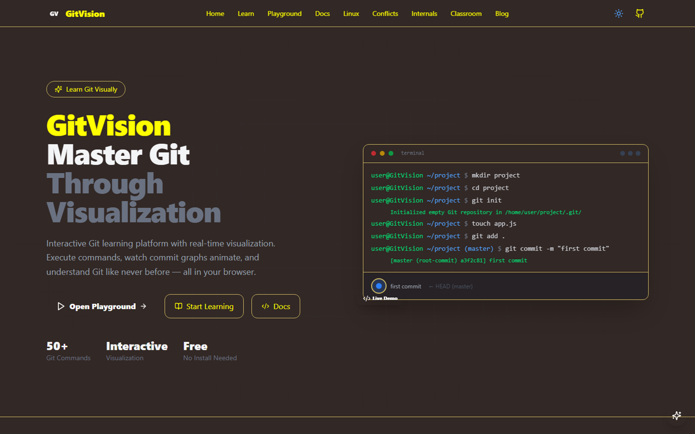
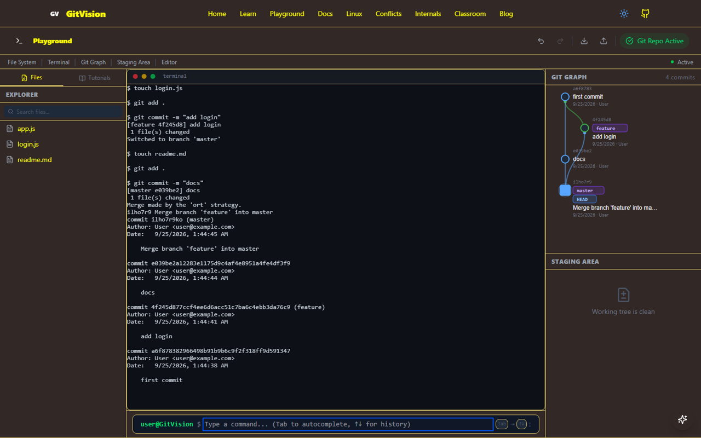

# 🌿 GitVision: Learn Git Visually

GitVision is an interactive Git learning platform. Instead of memorising commands, you type them into an in-browser terminal and watch the commit graph, staging area and file tree change in real time. Nothing touches a real repository, so it's a safe place to experiment, make mistakes and see exactly what each command does.



## ✨ Features

- **Playground:** a simulated terminal with a file explorer, a live **commit graph**, a **staging area** view and a code editor, side by side. Undo and redo any step, and export or import your session.
- **27 Git commands**, including `init`, `add`, `commit`, `status`, `log`, `diff`, `branch`, `switch`, `checkout`, `merge`, `rebase`, `reset`, `revert`, `cherry-pick`, `stash`, `tag`, `restore`, `clean`, `blame`, `bisect`, `reflog`, `show`, `worktree`, `remote`, `fetch`, `pull` and `push`, plus shell basics (`mkdir`, `cd`, `ls`, `touch`, `echo`, `cat`, `cp`, `mv`, `rm`).
- **Git-style object IDs:** files and regular commits get SHA-1 IDs computed the way Git does (`<type> <size>\0<content>`).
- **Guided tutorials:** step-by-step lessons on Git basics, branching and merging, working with remotes, and resolving merge conflicts, with the playground checking each step.
- **Merge conflict trainer:** a dedicated page for creating, understanding and resolving conflicts.
- **Docs:** a reference page for 35+ Git commands with examples.
- **Git internals:** how objects, trees, refs and `HEAD` actually work.
- **Linux basics:** the shell commands you need before Git.
- **Classroom mode:** structured lessons for instructor-led or self-paced courses.
- **Assistant:** a context-aware helper that suggests the next command based on your repository state (e.g. "you have staged files, commit them").
- **Light and dark themes**, and state saved in the browser (localStorage) so your progress survives a reload.



## 🛠️ Tech stack

| Area | Technology |
|---|---|
| Framework | Next.js 16 (App Router), React 19, TypeScript |
| Styling | Tailwind CSS 4, Radix UI primitives, Framer Motion |
| Terminal & editor | xterm.js, Monaco Editor |
| Commit graph | React Flow (`@xyflow/react`) |
| State | Zustand, persisted to localStorage |
| Content | MDX |
| Testing | Vitest (56 tests covering the Git engine and hashing) |

## 🚀 Getting started

Requires **Node.js 20+**.

```bash
git clone https://github.com/salahuddinselim/GitVision.git
cd GitVision
npm install
npm run dev
```

Open http://localhost:3000 and head to **Playground**, or start with **Learn**.

### Scripts

| Command | What it does |
|---|---|
| `npm run dev` | Start the development server |
| `npm run build` / `npm start` | Production build and server |
| `npm test` | Run the Vitest suite |
| `npm run typecheck` | TypeScript type check |
| `npm run lint` | ESLint |

## 📁 Project structure

```text
src/
├── app/                 # routes: playground, learn, docs/<command>, merge-conflicts,
│                        #         internals, linux-basics, classroom, blog
├── components/          # Terminal, GitGraph, StagingArea, FileExplorer, DiffViewer,
│   └── tutorials/       #   ConflictResolver, TutorialPanel, AIAssistant, ...
├── store/gitStore.ts    # the simulated Git engine (Zustand store)
├── lib/                 # SHA-1 object hashing and helpers
│   └── __tests__/       # Vitest tests
└── types/
```

## 👤 Author

**Salah Uddin Selim** · [Portfolio](https://salah-uddin-selim.vercel.app) · [GitHub](https://github.com/salahuddinselim)
